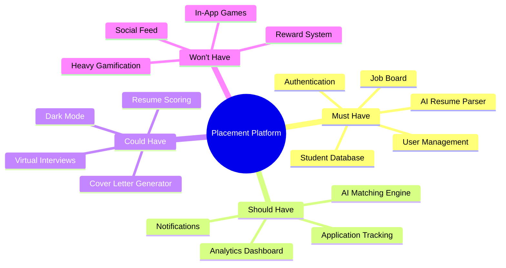
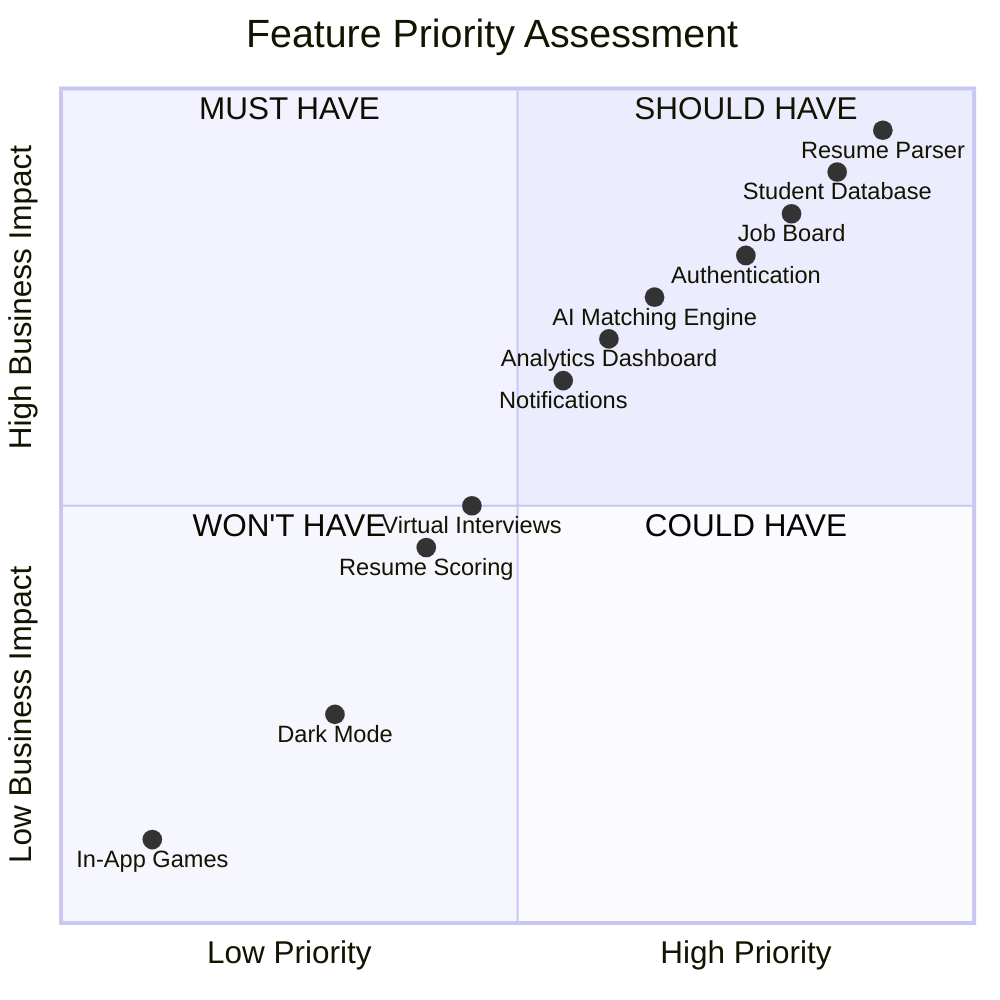
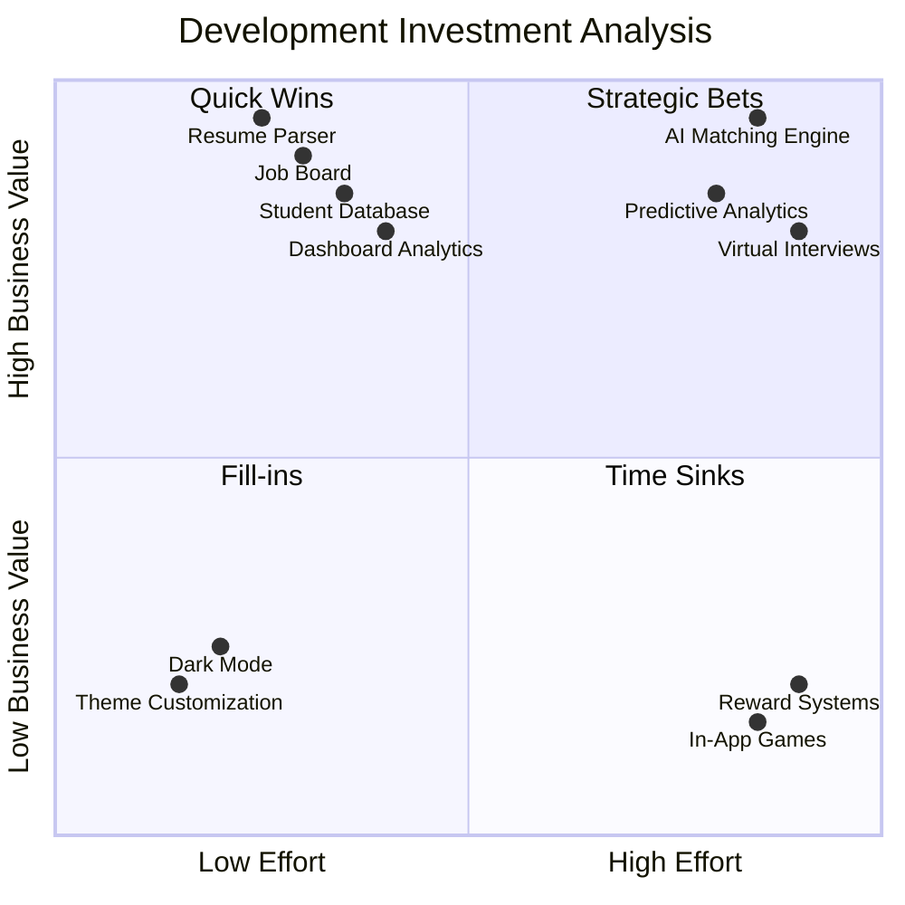
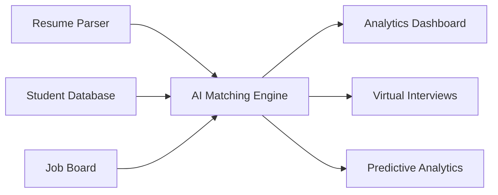
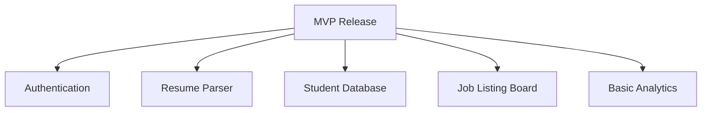
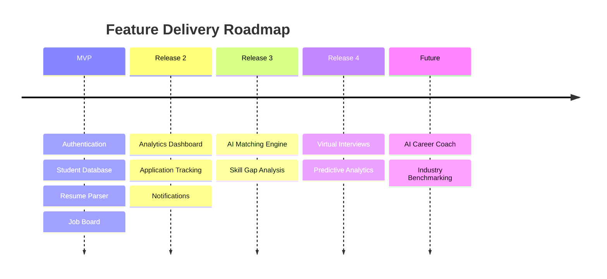

# 🎯 Feature Prioritization Strategy

## Why Prioritization Matters

The AI-Powered Placement Management Platform contains multiple features competing for development resources. To maximize impact, we use:

* **MoSCoW Prioritization Framework**
* **Value vs Effort Analysis**
* **Roadmap-Based Delivery Planning**

This ensures the MVP delivers the highest business value while maintaining a realistic development timeline.

---

# Product Prioritization Overview



---

# MoSCoW Prioritization Matrix



---

# Value vs Effort Matrix



---

# Feature Dependency Map

Understanding dependencies helps determine the implementation sequence.



---

# MVP Scope



### Expected Outcomes

* Faster student onboarding
* Centralized placement management
* Immediate recruiter engagement
* Actionable placement analytics

---

# Product Roadmap



---

# Strategic Recommendation

## 🚀 Build First

* Resume Parser
* Student Database
* Authentication
* Job Board
* Dashboard

## 🧠 Build Next

* AI Matching Engine
* Skill Gap Analysis
* Recommendation System

## ⏳ Build Later

* Virtual Interviews
* Predictive Analytics
* AI Career Assistant

## ❌ Avoid

* In-App Games
* Social Feeds
* Reward Systems
* Heavy Gamification

---

# Key Takeaway
The platform should prioritize **high-value, low-effort features** during MVP development to achieve rapid adoption and measurable impact. Advanced AI capabilities such as intelligent matching and predictive analytics should be introduced incrementally as strategic differentiators in future releases.

                           │
```

> **Project Strategy:** Focus development on the **Quick Wins** quadrant during MVP implementation to achieve rapid user adoption and demonstrable value. Subsequently invest in **Strategic Bets** such as the AI Matching Engine to establish long-term differentiation and scalability. Features categorized as **Time Sinks** should remain outside the project scope.
