# Product Requirements Document (PRD)

# AI-Powered Placement Management Platform

## Product Vision

> Transform campus recruitment from a manual, fragmented process into an intelligent, AI-driven placement ecosystem that improves placement outcomes for students, recruiters, and institutions.

---

# System Overview

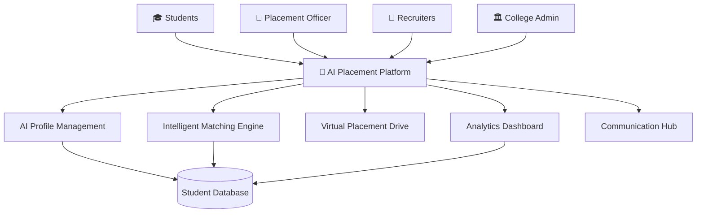

---

# Core Product Architecture

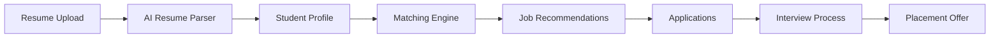

---

# Module 1: AI Profile Management

## Objective

Create intelligent student profiles automatically from resumes and academic records.

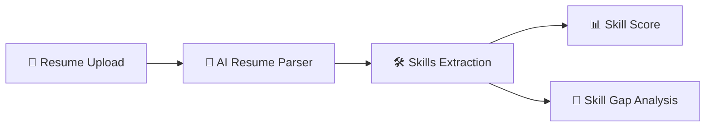

### Features

#### Resume Parsing

* Education Extraction
* Skills Identification
* Experience Recognition
* Certification Detection

#### Skill Assessment

* Placement Readiness Score
* Industry Readiness Score
* Department Benchmarking

#### Skill Gap Analysis

* Missing Technical Skills
* Missing Certifications
* Improvement Recommendations

---

# Module 2: Intelligent Matching Engine

## Objective

Match students with the most relevant opportunities.

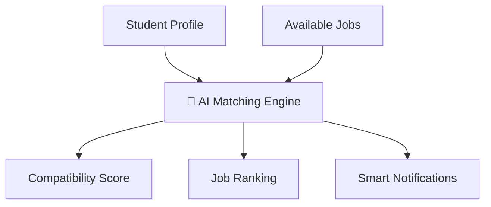

### Matching Criteria

| Parameter            | Weight |
| -------------------- | ------ |
| Technical Skills     | 35%    |
| Academic Performance | 20%    |
| Projects             | 15%    |
| Certifications       | 10%    |
| Experience           | 10%    |
| Career Interests     | 10%    |

### Output

* AI Match Percentage
* Personalized Recommendations
* Eligibility Verification
* Auto-Apply Suggestions

---

# Module 3: Analytics & Dashboard

## Objective

Provide complete visibility into placement performance.

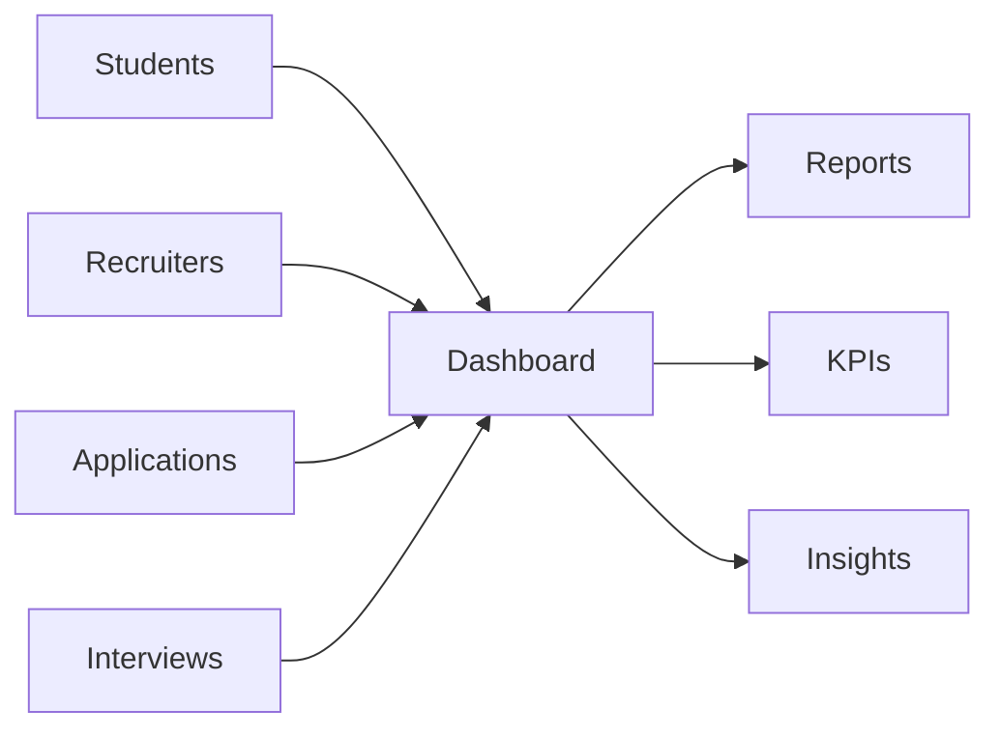

### Dashboard Components

* Placement Funnel
* Department Analytics
* Company Analytics
* Hiring Trends
* Placement Rate Tracking

---

# Placement Funnel

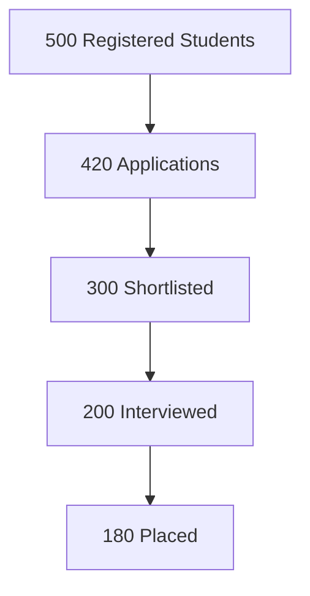

---

# Module 4: Virtual Placement Drive

## Objective

Digitize the complete recruitment workflow.

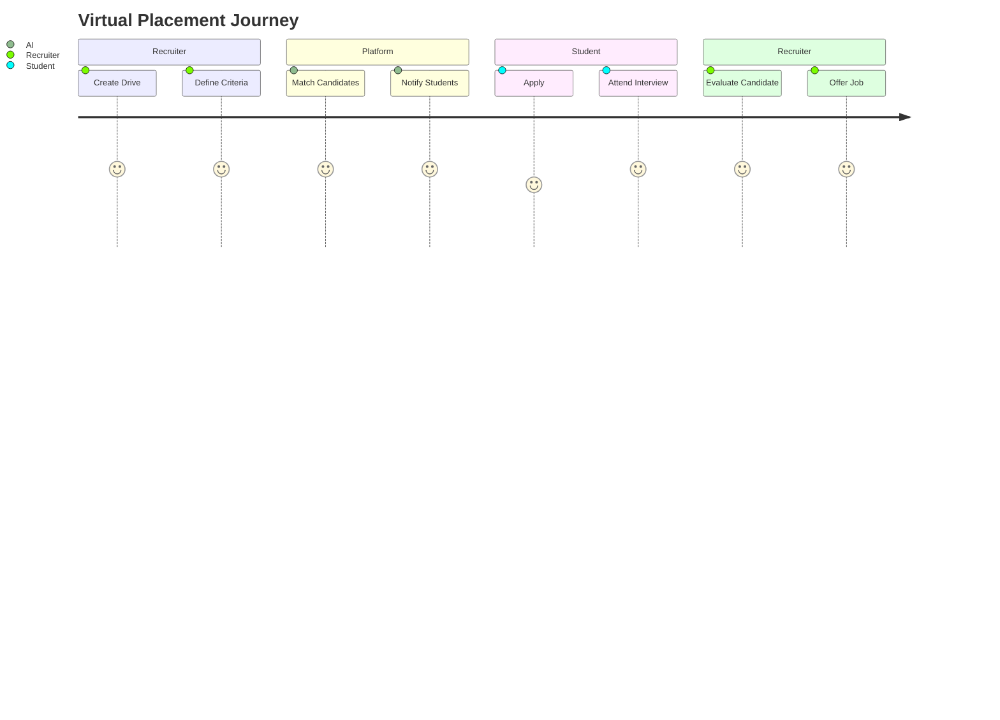

### Features

* Automated Scheduling
* Interview Slot Allocation
* Video Interview Integration
* Digital Offer Letter Management

---

# Module 5: Communication Hub

## Objective

Provide centralized communication across all stakeholders.

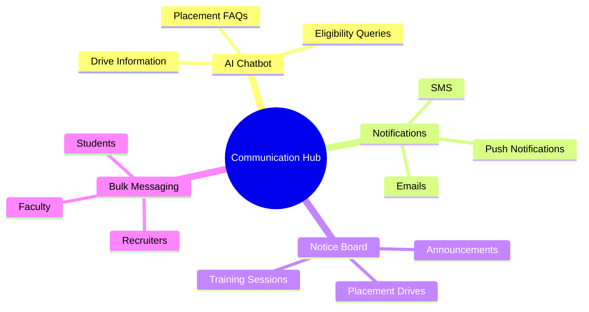

---

# User Journey: Student

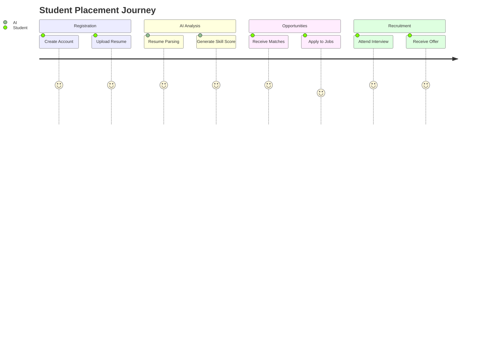

---

# User Journey: Placement Officer

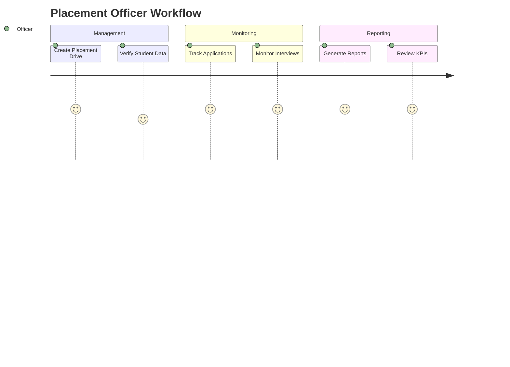

---

# Product Roadmap

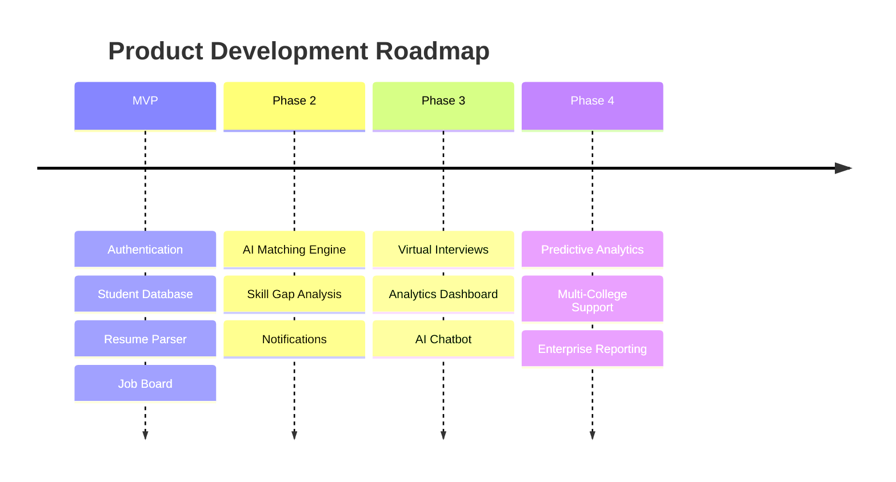

---

# Success Metrics

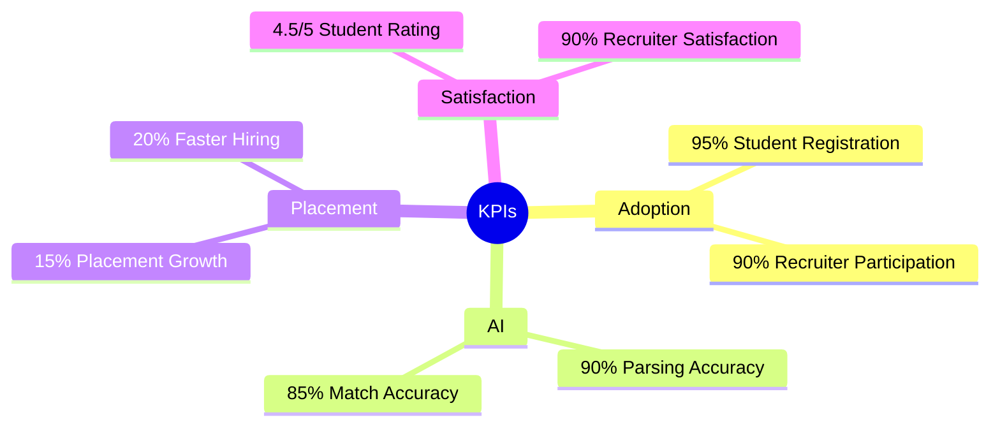

---

# Long-Term Vision

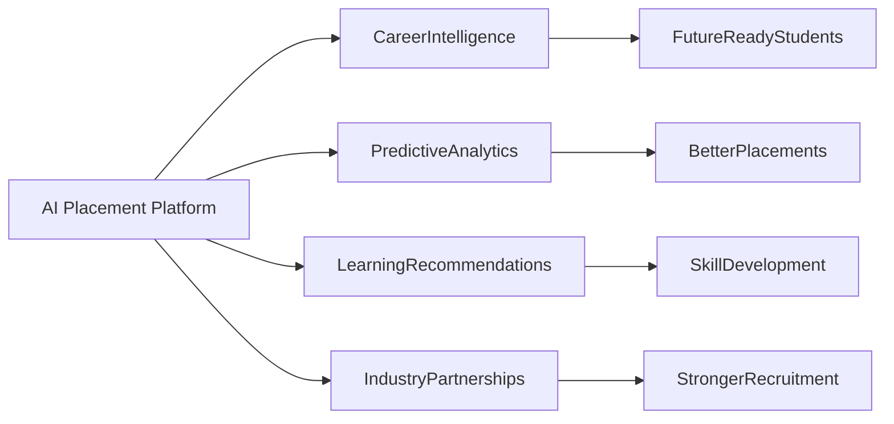

**Goal:** Build a comprehensive AI-powered Career Intelligence System that not only manages placements but actively improves employability outcomes and strengthens industry-academia collaboration.

