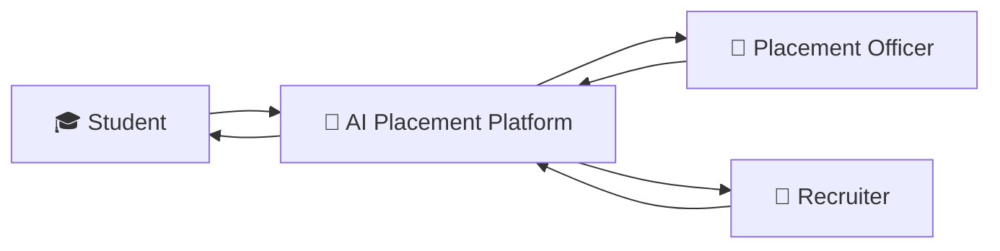
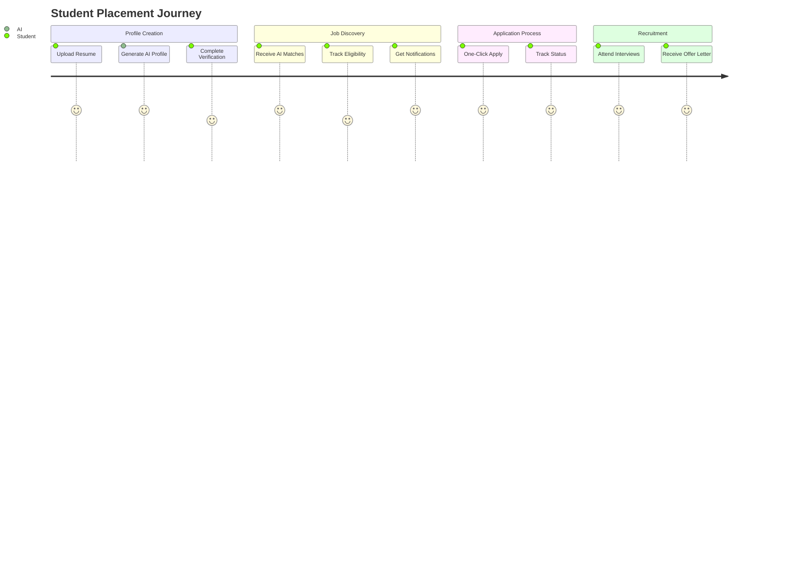
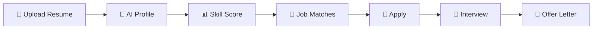
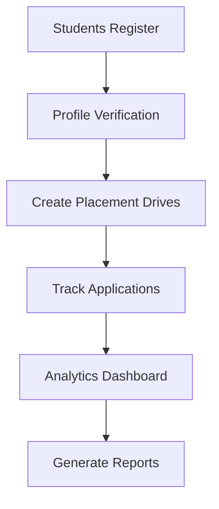
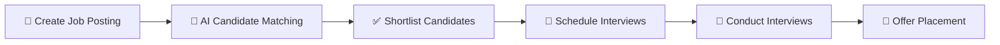
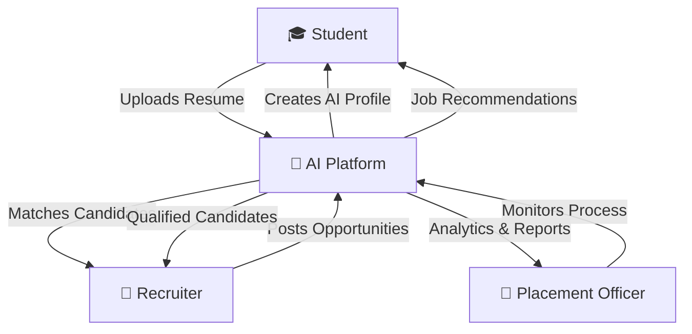
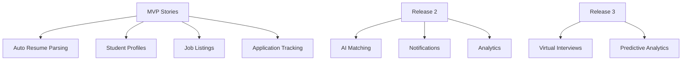

# 👥 User Stories & Jobs-To-Be-Done Map

## Overview

This document captures the primary stakeholders of the AI-Powered Placement Management Platform and the jobs they are trying to accomplish. Rather than focusing on features, the platform is designed around user outcomes and real-world workflows.

---

# Stakeholder Ecosystem

---

# Jobs-To-Be-Done Story Map

---

# 🎓 Student Persona

## Goal

Secure the best possible internship or placement opportunity with minimal manual effort.

### User Story 1 — AI Profile Creation

**As a Student,**
I want my profile to be automatically generated from my resume,
**so that** I can avoid repetitive data entry and apply faster.

### User Story 2 — Personalized Job Discovery

**As a Student,**
I want AI-generated job recommendations,
**so that** I only see opportunities relevant to my skills and interests.

### User Story 3 — Instant Opportunity Alerts

**As a Student,**
I want real-time notifications for matching opportunities,
**so that** I never miss an application deadline.

### User Story 4 — One-Click Application

**As a Student,**
I want to apply using my AI-generated profile,
**so that** I can complete applications quickly.

---

## Student Workflow

---

# 💼 Placement Officer Persona

## Goal

Efficiently manage placement operations, monitor performance, and reduce administrative workload.

### User Story 1 — Placement Analytics

**As a Placement Officer,**
I want a real-time analytics dashboard,
**so that** I can instantly monitor placement performance.

### User Story 2 — Automated Communication

**As a Placement Officer,**
I want bulk communication tools,
**so that** I can reduce manual coordination effort.

### User Story 3 — Placement Monitoring

**As a Placement Officer,**
I want visibility into every stage of the placement pipeline,
**so that** I can identify bottlenecks early.

### User Story 4 — Reporting Automation

**As a Placement Officer,**
I want reports generated automatically,
**so that** I can provide updates to management without manual compilation.

---

## Placement Officer Workflow

---

# 🏢 Recruiter Persona

## Goal

Identify and hire the most suitable candidates quickly and efficiently.

### User Story 1 — AI Candidate Shortlisting

**As a Recruiter,**
I want AI-powered candidate recommendations,
**so that** I can reduce screening effort and find better candidates faster.

### User Story 2 — Smart Candidate Search

**As a Recruiter,**
I want advanced filtering and ranking tools,
**so that** I can focus on the most qualified applicants.

### User Story 3 — Virtual Recruitment

**As a Recruiter,**
I want integrated interview scheduling and virtual drives,
**so that** I can recruit students efficiently.

### User Story 4 — Faster Hiring Decisions

**As a Recruiter,**
I want consolidated student profiles and skill insights,
**so that** I can make informed hiring decisions quickly.

---

## Recruiter Workflow

---

# Cross-Stakeholder Story Map

---

# User Story Prioritization

---

# Success Outcomes

### Students

* Faster applications
* Better job matching
* Improved placement readiness

### Placement Officers

* Reduced administrative workload
* Better placement visibility
* Faster reporting

### Recruiters

* Faster candidate discovery
* Better hiring decisions
* Reduced screening effort

---

## Key Principle

> Every feature in the platform must directly support at least one stakeholder job-to-be-done. Features that do not contribute to measurable user outcomes should not be prioritized for development.
