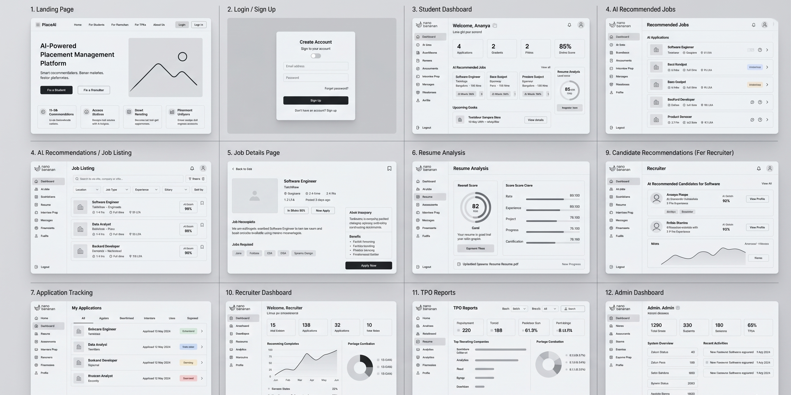

# Wireframes

# AI-Powered Placement Management Platform

This document contains the wireframe designs and UI structure planning for the AI-Powered Placement Management Platform.

The wireframes were designed to improve usability, simplify navigation, and create a centralized placement management experience for students, recruiters, and placement officers.

---

# Design Objectives

The wireframe design focuses on:

* Clean and intuitive user interface
* Simplified navigation workflow
* Centralized dashboard structure
* Easy accessibility of placement-related information
* Responsive and user-friendly layouts

---

# Included Wireframes

The following interface designs are included in the wireframe prototype:

* Student Dashboard
* Resume Upload Interface
* Job Recommendation Page
* Recruiter Dashboard
* Candidate Management Interface
* Placement Officer Dashboard
* Analytics and Reporting Interface

---

# Design Considerations

The UI/UX design was created using the following principles:

* Minimal interaction complexity
* Consistent layout structure
* Easy workflow visibility
* Organized information hierarchy
* Responsive design support

---

# Wireframe Preview

The complete wireframe design is available in the attached PNG prototype file.

---

# Conclusion

The wireframes establish the foundational UI structure for the AI-Powered Placement Management Platform and provide a scalable blueprint for future frontend implementation.
